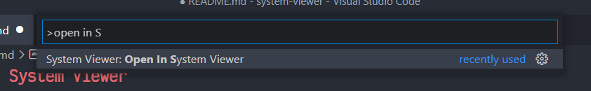
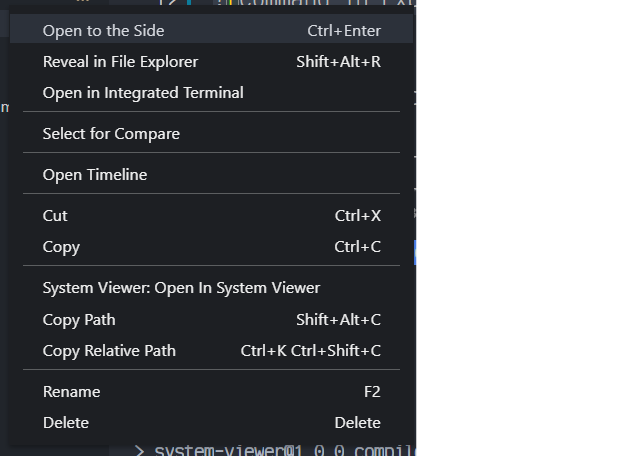

# System Viewer

## Synopsis
This extension contributes a command \(Open File In System Viewer\) to immediately open the current
file using the system viewer (as noted by the name). It also contrbutes a button to the explorer
context menu to open the file selected.

Command Palette:
__________________________________________________________________________________________________________________

Explorer Context Menu:
__________________________________________________________________________________________________________________

Internally, the extension uses the package [open](https://www.npmjs.com/package/open) to handle the actual opening of files.

If you liked the extension, please consider giving it a star.